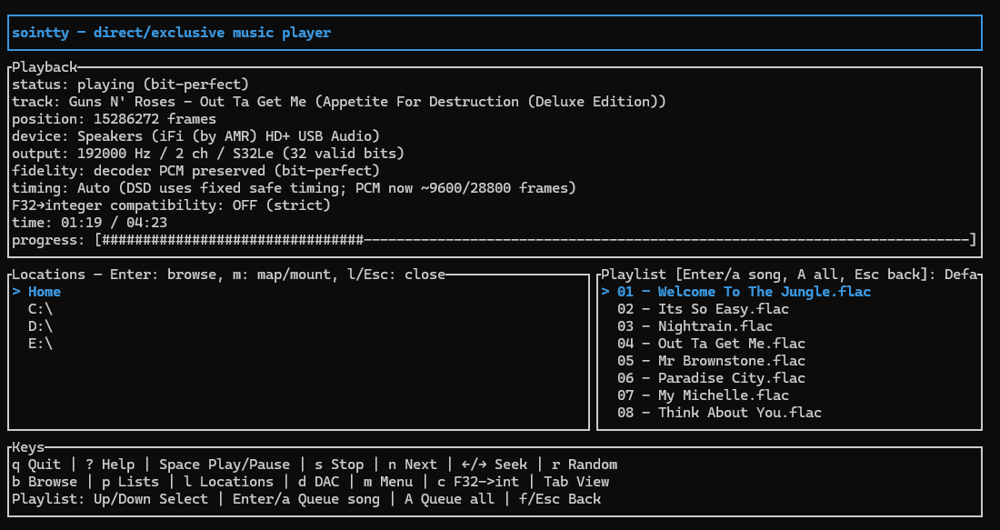

# Sointty

A terminal music player with a bit-perfect output path. What the decoder
produces is what the device gets: same samples, same rate, same channels.
No resampling, no volume processing, no EQ, no mixer in between.

[](LICENSE-MIT)
[](https://blog.rust-lang.org/releases/)
[](#platforms)

v1 feature complete (see [`docs/PLAN.md`](docs/PLAN.md)). Verified on Windows
(iFi USB DAC) and macOS (iFi ZEN DAC V2); the Linux backend is implemented
and unit tested, hardware testing pending.



The terminal shows the negotiated output, elapsed position, current navigation
pane, selected playlist, and a context-sensitive key guide.

## Behavior

- If the output device can't take the stream exactly as decoded, playback fails
  with a typed error instead of a silent conversion. Two explicit opt-ins relax
  this: `--allow-float-to-int` (TUI `c`) enables F32→integer conversion for
  float-decoding formats on integer-only devices, and `--allow-int-to-float`
  (TUI `i`) enables integer→F32 conversion on float-only endpoints such as the
  macOS internal speakers (S16/S24 convert exactly; S32 loses its low 8 bits).
  Converted output is labeled `NOT bit-perfect` in the UI.
- On macOS, hog mode is paired with Core Audio Integer Mode: non-mixable
  integer stream formats are selected for both the hardware and IOProc sides
  when the driver offers them, so capable USB DACs receive the exact integer
  samples with no conversion anywhere. The integer→F32 opt-in is only needed
  on endpoints whose IOProc interface is float-only.
- The negotiated format (rate, channels, packing, valid bits) is shown on
  screen as established with the device, not as requested.
- Tracks with an identical stream specification play gaplessly through one
  open device.
- File reads go through a bounded read-ahead worker, so slow or mounted drives
  stall gracefully and Stop/Skip/Seek stay responsive. Stalls and underruns
  are reported, not hidden.
- Local files only; remote URLs are rejected.

## Quick start

```sh
# Linux: ALSA headers required; libopus for the default Opus support
sudo apt install libasound2-dev libopus-dev
cargo build --release

# Windows / macOS: no system audio dependencies
cargo build --release
```

```sh
sointty --list-devices                 # list output endpoints
sointty /path/to/album/                # play files or folders
sointty playlist.m3u                   # playlists expand into tracks
```

With no arguments, sointty opens a filesystem browser where you last left it
(first launch: your home folder). A key guide stays visible at the bottom and
changes with the active pane. Press `?` for full help, `m` for the menu, or `q`
to quit immediately from any pane without backing out through menus. While
typing in an input prompt, `q` is text; use `Ctrl+Q` to quit immediately.
Press `d` to choose and save the output device.

### Keys

| Key | Action |
|---|---|
| `space` | play / pause |
| `s` / `n` | stop / next track |
| `←` / `→` | seek back / forward 10 s |
| `b` | file browser (`Enter` plays, `a` adds to playlist, `A` adds the folder, `Backspace` goes up or shows drives at root) |
| `p` | playlists: `↑`/`↓` highlight a list, `a` appends that whole list; `Tab` focuses songs, `a`/`Enter` appends one song, `A` appends the whole highlighted list |
| `l` | locations: drives and network shares (map/mount via the OS) |
| `f` | focus the visible saved playlist: `↑`/`↓` select, `a`/`Enter` appends one song, `A` appends the whole list; `Esc` returns to browser |
| `Tab` | switch right pane between selected playlist and live queue (in the Playlists pane, switch between lists and songs) |
| `r` | toggle random play for the live queue; the current song and preopened next song stay in place |
| `m` / `?` | menu / full keyboard help |
| `d` | choose output device |
| `c` | allow F32→integer conversion (off by default) |
| `i` | allow integer→F32 conversion for float-only devices (off by default) |
| `q` | quit immediately from any non-input pane |
| `Ctrl+Q` | quit immediately, including while typing in a prompt |
| `Esc` | close the current pane or step back through menus; quit when no pane is open |

Buffer timing (period/buffer frames) is adjustable under `m` → DAC settings;
Auto derives timing from each track's sample rate.

Playback shows elapsed/total time and a text progress bar. When the decoder
cannot report a reliable length, the total reads `--:--` and the bar remains
empty instead of estimating from file size.

Settings live in `<config dir>/sointty/config.toml`
(`%APPDATA%\sointty\sointty\config\config.toml` on Windows,
`~/.config/sointty/config.toml` on Linux). Command-line flags override the
file. Named playlists live in `<data dir>/sointty/playlists.toml`; adding
tracks never touches the playback queue.
Random play shuffles only upcoming queue entries, not saved playlists. Turning it
off keeps the current queue order and appends future songs in order. The same
toggle is available under `m` → Queue.

## Fidelity rules

- PCM passes through unchanged. The only permitted transforms are lossless:
  channel interleaving, byte-order packing, and widening into a larger
  container with zeroed low bits (e.g. 24-bit samples in a 32-bit slot).
- Rate, channel mask, packing, and valid bits are confirmed with the device at
  initialization; mismatches raise `UnsupportedFormat`.
- F32→integer conversion, when enabled, is round-to-nearest-even with clipping
  and no dither, and runs on the decoder thread, not the render thread.
- Integer→F32 conversion, when enabled, divides by the full-scale integer
  range with no dither and likewise runs on the decoder thread. S16 and S24
  values land exactly in the F32 mantissa; S32 rounds to 24-bit precision.
- DSD is a separate stream type: native DSD or DoP on ALSA, never converted to
  PCM.
- No `cpal`, no ALSA `plug`/`plughw`/`default`, no WASAPI shared mode, no
  Core Audio system mixer or aggregate devices.

## Formats

| Source | Formats | Notes |
|---|---|---|
| Symphonia (built in) | FLAC, ALAC, WAV/AIFF, MP3, AAC-LC, Vorbis | always available |
| Ogg Opus | `.opus` | default on Linux, `--features opus` elsewhere |
| FFmpeg (opt-in) | APE, WavPack, TAK, Musepack, DSF/DFF | `--features ffmpeg-lgpl`, needs system FFmpeg 9 |

Playlists: M3U/M3U8 (read+write), PLS, XSPF, single-image CUE with gapless
adjacent ranges.

## Platforms

| OS | Backend | Status |
|---|---|---|
| Linux | ALSA `hw:` direct, native DSD and DoP | implemented, awaiting hardware test |
| Windows | WASAPI exclusive, push-mode fallback for drivers that force whole-buffer periods | tested on an iFi ZEN DAC V2 |
| macOS | Core Audio HAL hog mode | tested on an iFi ZEN DAC V2 |

### Tested devices

| Device | OS | Verified path |
|---|---|---|
| iFi ZEN DAC V2 | macOS | 192 kHz S24 FLAC, bit-perfect via Core Audio Integer Mode (non-mixable integer formats, hog mode) |
| iFi ZEN DAC V2 | Windows | WASAPI exclusive, integer path |

## Building

MSRV is Rust 1.98.1 (edition 2024). Optional features on the app crate:

- `library-index`: opt-in SQLite index of the music collection. Off by default;
  filesystem browsing never touches a database.
- `ffmpeg-lgpl`: extra formats via a system FFmpeg 9 (LGPL builds only). Set
  `FFMPEG_DIR` (and `LIBCLANG_PATH` for bindgen) if discovery fails.

```sh
cargo build --release --features library-index
cargo build --release --features ffmpeg-lgpl
cargo test --workspace
```

## Repository layout

```
crates/
  core              shared types and exact-packing rules
  source            read-ahead file access with stall recovery
  decode            Symphonia, Opus, and FFmpeg decoders; tag reading
  playlist          M3U/M3U8/PLS/XSPF/CUE
  library           optional SQLite index
  output-alsa       Linux ALSA backend
  output-wasapi     Windows WASAPI backend
  output-coreaudio  macOS Core Audio backend
  tui               terminal UI and file browser
  app               player engine and command line
docs/PLAN.md        design notes, milestones, acceptance criteria
```

## Contributing

Issues and pull requests are welcome. Any change to the audio signal must be
explicit, opt-in, and labeled in the UI.

## License

MIT or Apache-2.0, your choice: [LICENSE-MIT](LICENSE-MIT),
[LICENSE-APACHE](LICENSE-APACHE).

The optional `ffmpeg-lgpl` feature dynamically links FFmpeg (LGPL-2.1-or-later);
only distribute binaries built against LGPL FFmpeg builds.
